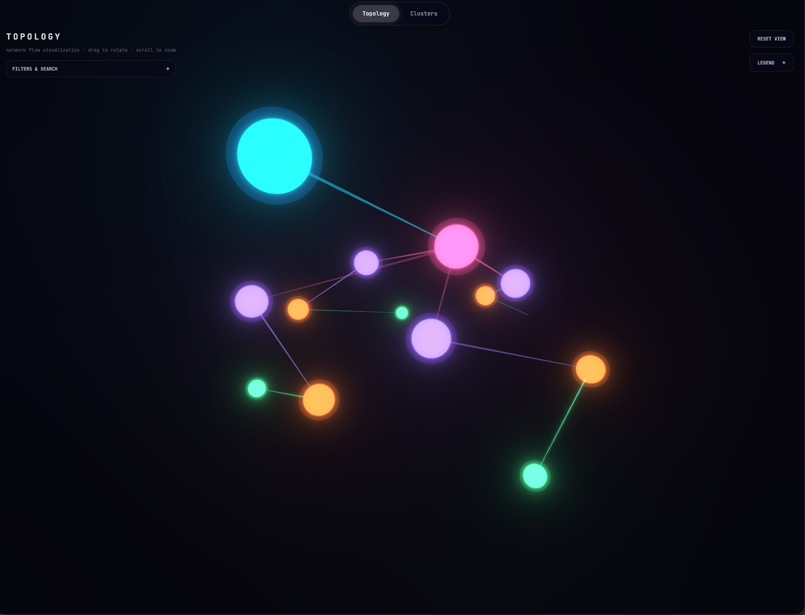
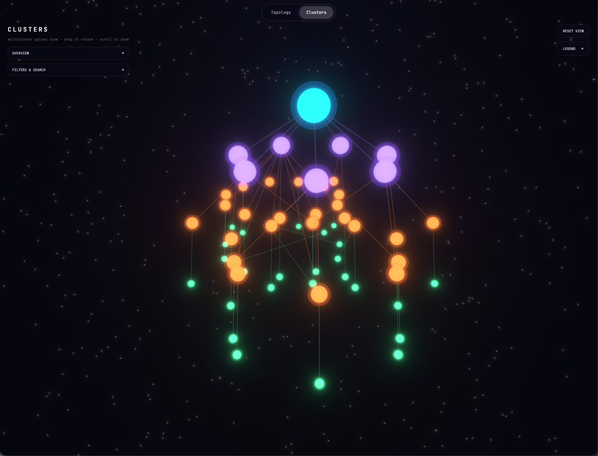

<div align="center">

# Porter Galaxy

**Visualize your Kubernetes cluster as a living galaxy.**

A force-directed graph of every Pod, Service, and Deployment and the relationships between them, rendered with Three.js and served by a Go backend that reads live cluster state through `client-go`.

[](https://github.com/NoeOsorio/porter-galaxy/releases)
[](https://github.com/NoeOsorio/porter-galaxy/actions/workflows/publish.yml)
[](https://github.com/noeosorio/porter-galaxy/pkgs/container/charts%2Fporter-galaxy)
[](https://github.com/NoeOsorio/porter-galaxy/pkgs/container/porter-galaxy-backend)
[](https://github.com/NoeOsorio/porter-galaxy/pkgs/container/porter-galaxy-frontend)
[](LICENSE)

</div>

<p align="center">
  
  
</p>

---

## Why

`kubectl get` tells you *what* is in the cluster. Porter Galaxy shows you *how it all connects*: which Pods belong to which ReplicaSet, which Service selects which Deployment, where the dense regions are, and where the lonely dangling object lives. It runs in-cluster, pushes changes to the browser as they happen, and renders the whole thing on a single canvas you can fly around.

Both views render the same graph:

- **Topology**: every workload and its dependencies, force-laid-out so neighborhoods emerge naturally.
- **Clusters**: a hierarchical view (Namespace → Workload → Pod) for when you want structure instead of physics.

---

## Install

### Deploy on Porter (no CLI needed)

1. In the Porter dashboard, open **Add-ons → Create add-on → Helm Chart**.
2. Pick your cluster and name the add-on `porter-galaxy`.
3. Fill in the chart fields:

   | Field               | Value                            |
   | ------------------- | -------------------------------- |
   | Helm Repository URL | `oci://ghcr.io/noeosorio/charts` |
   | Chart Name          | `porter-galaxy`                  |
   | Chart Version       | `0.2.0`                          |

4. Paste this into **Values YAML → Custom Values**:

   ```yaml
   ingress:
     enabled: true
     className: nginx
     host: ""
   ```

5. Click **Review changes → Deploy changes**. The add-on shows **Deployed** once both pods are running.
6. The app is served on the hostname of the cluster's ingress load balancer. Get it with:

   ```bash
   porter kubectl -- get svc -n ingress-nginx ingress-nginx-controller \
     -o jsonpath='{.status.loadBalancer.ingress[0].hostname}'
   ```

   Open `http://<that-hostname>/`.

With `host: ""` the app answers on any hostname the ingress doesn't already route, so the load balancer URL works with no DNS setup. To use your own domain, create a CNAME from it to the load balancer hostname and set `host: galaxy.yourdomain.com`.

Newer chart versions are listed on the [package page](https://github.com/noeosorio/porter-galaxy/pkgs/container/charts%2Fporter-galaxy); change **Chart Version** to upgrade. The images are built for `amd64` only, so the pods need x86 nodes.

### One-liner with Helm

```bash
helm install galaxy oci://ghcr.io/noeosorio/charts/porter-galaxy \
  --namespace porter-galaxy --create-namespace
```

Then port-forward and open it:

```bash
kubectl port-forward svc/galaxy-porter-galaxy-frontend 8080:80 -n porter-galaxy
open http://localhost:8080
```

### Expose it with an Ingress

```bash
helm upgrade galaxy oci://ghcr.io/noeosorio/charts/porter-galaxy \
  --namespace porter-galaxy --reuse-values \
  --set ingress.enabled=true \
  --set ingress.className=nginx \
  --set ingress.host=galaxy.example.com
```

### Private GHCR images

If your fork uses private container images, create a pull secret and pass it to the chart:

```bash
kubectl create secret docker-registry ghcr-creds \
  --docker-server=ghcr.io --docker-username=YOUR_USER \
  --docker-password=YOUR_PAT --namespace porter-galaxy

helm upgrade galaxy oci://ghcr.io/noeosorio/charts/porter-galaxy \
  --namespace porter-galaxy --reuse-values \
  --set 'imagePullSecrets[0].name=ghcr-creds'
```

Full deploy walkthrough: [DEPLOY_MANUAL.md](DEPLOY_MANUAL.md).

---

## Local development

```bash
# 1. Frontend (Vite dev server, hot reload)
cd frontend && npm install && npm run dev

# 2. Backend (against your current kubeconfig context)
cd backend && go run ./cmd/server
```

Or boot everything inside a local **kind** cluster with one command:

```bash
make up        # build images, load into kind, helm install the chart
make open      # port-forward the frontend to http://localhost:8888
make logs-backend
```

`make help` lists every target.

---

## Architecture

```
                        ┌─────────────────────────────┐
                        │  React 19 + Three.js (Vite) │
                        │  Force-directed canvas      │
                        └──────────────┬──────────────┘
                                       │ /api/*  (nginx proxy)
                        ┌──────────────▼──────────────┐
                        │  Go backend (client-go)     │
                        │  Watches Pods/Svcs/Deploys  │
                        │  Builds nodes + edges       │
                        └──────────────┬──────────────┘
                                       │ Kubernetes API
                                       ▼
                              your live cluster
```

| Layer        | Tech                                                        |
| ------------ | ----------------------------------------------------------- |
| Frontend     | React 19, TypeScript, Vite, Tailwind v4, Three.js (R3F)     |
| Backend      | Go 1.22, `k8s.io/client-go` informers                       |
| Distribution | Multi-stage Docker images on GHCR, Helm chart as OCI on GHCR |
| RBAC         | ClusterRole + ClusterRoleBinding (read-only across the cluster) |

The backend uses informers to keep an in-memory graph in sync with the cluster and streams each change to the browser over Server-Sent Events, so the frontend never queries the Kubernetes API server.

---

## Repository layout

```
porter-galaxy/
├── backend/                 # Go API server
│   ├── cmd/server/          # Entry point
│   └── internal/
│       ├── api/             # HTTP handlers
│       ├── cluster/         # Cluster client wiring
│       ├── informers/       # client-go informer setup
│       ├── registry/        # Object registry → graph
│       └── store/           # In-memory graph store
├── frontend/                # React + Three.js app
│   ├── src/
│   │   ├── GalaxyGraph.tsx  # Canvas + state
│   │   ├── Topology.tsx     # Force-directed view
│   │   ├── Clusters.tsx     # Hierarchical view
│   │   ├── components/      # HUD, legend, node detail
│   │   └── lib/             # Pure graph + render helpers
│   └── nginx.conf.template  # Serves static + proxies /api
├── charts/porter-galaxy/    # Helm chart (deployments, svcs, ingress, RBAC)
├── .github/workflows/       # publish.yml — tag-driven release
├── Makefile                 # dev + release commands
└── DEPLOY_MANUAL.md         # Full deploy guide
```

---

## Configuration

The chart's most useful values:

| Value                          | Default                                  | What it does                                |
| ------------------------------ | ---------------------------------------- | ------------------------------------------- |
| `backend.image.repository`     | `ghcr.io/noeosorio/porter-galaxy-backend`  | Backend image                               |
| `frontend.image.repository`    | `ghcr.io/noeosorio/porter-galaxy-frontend` | Frontend image                              |
| `*.image.tag`                  | `Chart.AppVersion`                       | Override per-release if needed              |
| `imagePullSecrets`             | `[]`                                     | Secrets for private registries              |
| `service.type`                 | `ClusterIP`                              | Set to `LoadBalancer` for a public IP       |
| `ingress.enabled`              | `false`                                  | Toggle Ingress object                       |
| `ingress.className`            | `""`                                     | e.g. `nginx`, `alb`                         |
| `ingress.host`                 | `""`                                     | Public DNS name                             |
| `ingress.tls`                  | `[]`                                     | Standard `tls:` block (cert-manager works)  |
| `serviceAccount.create`        | `true`                                   | Backend RBAC needs a ServiceAccount         |

Full default values: [`charts/porter-galaxy/values.yaml`](charts/porter-galaxy/values.yaml).

---

## Releasing

> **Releases are tag-driven.** Pushing to `main` does not publish anything. The `Publish` workflow only runs on tags matching `v*.*.*`.

```bash
make release VERSION=1.1.0
# bumps Chart.yaml, commits, then creates and pushes the v1.1.0 tag
```

CI then:

1. Builds and pushes `ghcr.io/<owner>/porter-galaxy-{backend,frontend}:1.1.0`, `:1.1`, `:latest`.
2. Rewrites `Chart.yaml` to pin `appVersion: 1.1.0` (matches the image tag).
3. Packages the chart and pushes it to `oci://ghcr.io/<owner>/charts/porter-galaxy`.

Packages pushed by the workflow inherit the repository's visibility. If your repo is private, set the `charts/porter-galaxy` package and both images to Public in GitHub → Packages, or anonymous `helm install` and Porter add-ons can't pull them.

Full flow: [DEPLOY_MANUAL.md](DEPLOY_MANUAL.md).

---

## Roadmap

- [x] Force-directed canvas with Three.js
- [x] Topology + Clusters views
- [x] Helm chart + tag-driven CI
- [x] In-cluster RBAC for read-only graph access
- [x] Live updates over Server-Sent Events
- [ ] Search / filter / namespace scoping in the UI
- [ ] Node-detail side panel for any object kind
- [ ] Export current view as PNG / share URL
- [ ] Optional Go → WASM force simulation for large clusters

---

## Contributing

PRs welcome. Conventional Commits encouraged but not enforced.

```bash
git checkout -b feat/your-thing
# hack hack hack
git commit -m "feat: your thing"
git push origin feat/your-thing
gh pr create
```

If you're touching the chart, run `helm lint charts/porter-galaxy && make template` before pushing.

---

## License

[MIT](LICENSE) © Noé Osorio
