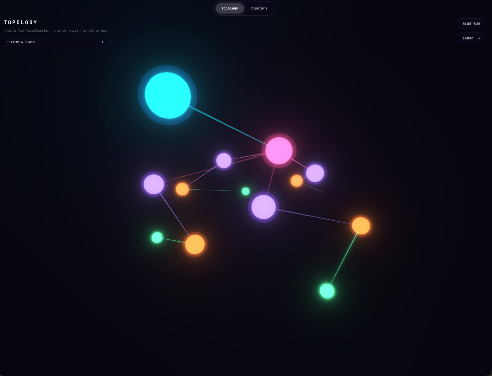
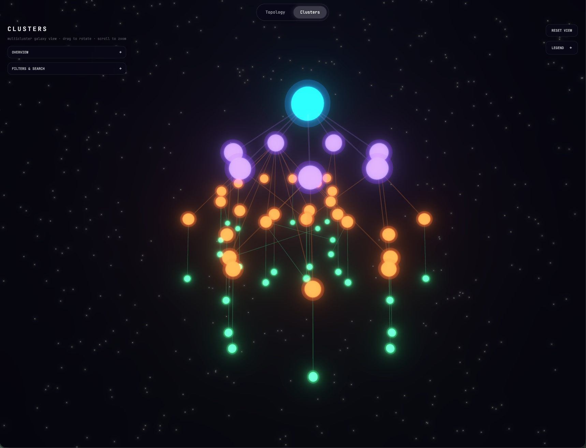

<div align="center">

# Porter Galaxy

**Visualize your Kubernetes cluster as a living galaxy.**

A force-directed graph of every Pod, Service, and workload and the relationships between them, rendered with Three.js and served by a Go backend that reads live cluster state through `client-go`.

[](https://github.com/NoeOsorio/porter-galaxy/releases)
[](https://github.com/NoeOsorio/porter-galaxy/actions/workflows/publish.yml)
[](https://github.com/noeosorio/porter-galaxy/pkgs/container/charts%2Fporter-galaxy)
[](https://github.com/NoeOsorio/porter-galaxy/pkgs/container/porter-galaxy-backend)
[](https://github.com/NoeOsorio/porter-galaxy/pkgs/container/porter-galaxy-frontend)
[](LICENSE)

</div>

<p align="center">
  
  
</p>

---

## Why

`kubectl get` tells you *what* is in the cluster. Porter Galaxy shows you *how it all connects*: which workload owns which Pods, which Ingress routes to which Service, where the dense regions are, and where the lonely dangling object lives. It runs in-cluster, pushes changes to the browser as they happen, and renders the whole thing on a single canvas you can fly around.

Both views render the same graph:

- **Topology**: how traffic reaches your workloads, from Internet → Load Balancer → Ingress → Service → Workload → Pod.
- **Clusters**: a hierarchical view (Cluster → Node → Workload → Pod) that shows where every Pod runs, including CronJob → Job → Pod.

Objects group by namespace, and adding a Pod never rearranges the rest of the map. Names appear where there is room and more detail shows up as you zoom in. Click a node or search for it and the camera flies to it; `R` reframes the whole graph, and the 3D/2D toggle flattens either view. Pods are colored by their real state (running, pending, completed, failed). It stays at 60 fps with thousands of Pods.

Deployments, StatefulSets, DaemonSets, Jobs, and CronJobs all appear, each with its own color. A Pod that restarted in the last 10 minutes pulses, and its panel shows the restart count, the last termination reason (`OOMKilled`, `Error`), and recent Warning events. Selecting a Pod draws the PVCs, ConfigMaps, and Secrets it uses; only their names come from the Pod spec, their contents are never read. With metrics-server installed, busy Pods and nodes are larger and brighter, relative to their requests or allocatable capacity.

---

## Install

### Deploy on Porter (no CLI needed)

1. In the Porter dashboard, open **Add-ons → Create add-on → Helm Chart**.
2. Pick your cluster and name the add-on `porter-galaxy`.
3. Fill in the chart fields:

   | Field               | Value                            |
   | ------------------- | -------------------------------- |
   | Helm Repository URL | `oci://ghcr.io/noeosorio/charts` |
   | Chart Name          | `porter-galaxy`                  |
   | Chart Version       | `0.12.0`                         |

4. Paste this into **Values YAML → Custom Values**:

   ```yaml
   ingress:
     enabled: true
     className: nginx
     host: ""
   ```

5. Click **Review changes → Deploy changes**. The add-on shows **Deployed** once both pods are running.
6. The app is served on the hostname of the cluster's ingress load balancer. Get it with:

   ```bash
   porter kubectl -- get svc -n ingress-nginx ingress-nginx-controller \
     -o jsonpath='{.status.loadBalancer.ingress[0].hostname}'
   ```

   Open `http://<that-hostname>/`.

With `host: ""` the app answers on any hostname the ingress doesn't already route, so the load balancer URL works with no DNS setup. To use your own domain, create a CNAME from it to the load balancer hostname and set `host: galaxy.yourdomain.com`.

Galaxy asks for a password when you open it; see [Signing in](#signing-in) to read the generated one. For an add-on named `porter-galaxy`:

```bash
porter kubectl -- get secret porter-galaxy-auth -n <add-on namespace> \
  -o jsonpath='{.data.password}' | base64 -d; echo
```

Newer chart versions are listed on the [package page](https://github.com/noeosorio/porter-galaxy/pkgs/container/charts%2Fporter-galaxy); change **Chart Version** to upgrade. The images are built for `amd64` only, so the pods need x86 nodes.

### One-liner with Helm

```bash
helm install galaxy oci://ghcr.io/noeosorio/charts/porter-galaxy \
  --namespace porter-galaxy --create-namespace
```

Then port-forward and open it:

```bash
kubectl port-forward svc/galaxy-porter-galaxy-frontend 8080:80 -n porter-galaxy
open http://localhost:8080
```

### Expose it with an Ingress

```bash
helm upgrade galaxy oci://ghcr.io/noeosorio/charts/porter-galaxy \
  --namespace porter-galaxy --reuse-values \
  --set ingress.enabled=true \
  --set ingress.className=nginx \
  --set ingress.host=galaxy.example.com
```

Over plain HTTP, the password you type to sign in and the session cookie cross the network unencrypted. Use HTTPS whenever the URL is reachable from outside your network.

### HTTPS with your own domain

HTTPS is optional and needs a domain you control, plus [cert-manager](https://cert-manager.io) with a ClusterIssuer in the cluster (Porter clusters come with `letsencrypt-prod`).

1. Create a DNS record for your host that points at the ingress controller's load balancer: a CNAME to its hostname, or an A record to its IP.

   ```bash
   kubectl get svc -n ingress-nginx ingress-nginx-controller \
     -o jsonpath='{.status.loadBalancer.ingress[0].hostname}'
   ```

2. Set the host and the issuer:

   ```yaml
   ingress:
     enabled: true
     className: nginx
     host: galaxy.example.com
     tls:
       clusterIssuer: letsencrypt-prod
   ```

   On Porter, paste this into the add-on's **Custom Values**. With Helm, pass it with `-f`.

3. cert-manager requests the certificate and renews it on its own. It is usually ready within a couple of minutes:

   ```bash
   kubectl get certificate -n <namespace>   # READY True
   ```

Then open `https://galaxy.example.com`. Signed-in sessions over HTTPS use a Secure cookie. If you manage certificates another way, list standard Ingress `tls` entries under `ingress.tls.extra`.

### Who can see your cluster

The chart installs with no Ingress and a `ClusterIP` Service, so only people with access to the cluster can reach it. Every option below still asks for the [Galaxy password](#signing-in).

| How you open it | Who can reach the sign-in page | What crosses the network unencrypted |
| --- | --- | --- |
| `kubectl port-forward` (default) | People with `kubectl` access to the namespace | Nothing: the tunnel to the API server is encrypted |
| Ingress or `LoadBalancer` over HTTP | Anyone who can reach the URL | The password when signing in, and the session cookie on every request |
| Ingress with your own domain and HTTPS | Anyone who can reach the URL | Nothing |

Galaxy never reads the contents of Secrets or ConfigMaps, only the names a Pod references, and its RBAC is read-only.

### Private GHCR images

If your fork uses private container images, create a pull secret and pass it to the chart:

```bash
kubectl create secret docker-registry ghcr-creds \
  --docker-server=ghcr.io --docker-username=YOUR_USER \
  --docker-password=YOUR_PAT --namespace porter-galaxy

helm upgrade galaxy oci://ghcr.io/noeosorio/charts/porter-galaxy \
  --namespace porter-galaxy --reuse-values \
  --set 'imagePullSecrets[0].name=ghcr-creds'
```

Full deploy walkthrough: [DEPLOY_MANUAL.md](DEPLOY_MANUAL.md).

### Signing in

Galaxy has a built-in login with one shared account, like the Grafana chart. The user is `admin`. If you set no password, the chart generates a random one on install, keeps it on upgrades, and the install notes print how to read it:

```bash
kubectl get secret <release>-porter-galaxy-auth -n <namespace> \
  -o jsonpath='{.data.password}' | base64 -d; echo
```

(When the release name already contains `porter-galaxy`, the Secret is `<release>-auth`.)

To choose the password, set `auth.password`, or point `auth.existingSecret` at a Secret with `username` and `password` keys. Changing the password signs everyone out within about a minute, without a restart. Sessions last 24 hours. Ten wrong passwords from the same address lock sign-in for ten minutes.

Setting `auth.enabled=false` removes the login: do it only when something else already controls who can reach the app.

---

## Local development

```bash
# 1. Frontend (Vite dev server, hot reload)
cd frontend && npm install && npm run dev

# 2. Backend (against your current kubeconfig context)
cd backend && go run ./cmd/server
```

Or boot everything inside a local **kind** cluster with one command:

```bash
make up        # build images, load into kind, helm install the chart
make open      # port-forward the frontend to http://localhost:8888
make logs-backend
```

### Load testing and verification

`backend/cmd/fakestream` serves synthetic snapshots so you can try the UI at sizes no dev cluster has:

```bash
cd backend && go run ./cmd/fakestream -pods 3000 -namespaces 20 -churn 500ms
cd frontend && GALAXY_API=http://localhost:4078 npm run dev
# open http://localhost:5173/?stats  (fps overlay; console logs layout settle time and displacement)
```

`make verify` runs the gates, builds the app against the fake stream, and drives headless Chrome through the functional, label, layout, performance, WebGL, stream, and no-metrics checks, writing screenshots to `verify-out/`. Runs are serialized with a lock, so several worktrees can develop in parallel while sharing one verification lane.

`make help` lists every target.

---

## Architecture

```
                        ┌─────────────────────────────┐
                        │  React 19 + Three.js (Vite) │
                        │  Topology + Clusters views  │
                        └──────────────┬──────────────┘
                                       │ /api/*  (nginx proxy)
                        ┌──────────────▼──────────────┐
                        │  Go backend (client-go)     │
                        │  Watches nodes, pods,       │
                        │  workloads, services,       │
                        │  ingresses, Warning events; │
                        │  polls metrics.k8s.io       │
                        └──────────────┬──────────────┘
                                       │ Kubernetes API
                                       ▼
                              your live cluster
```

| Layer        | Tech                                                        |
| ------------ | ----------------------------------------------------------- |
| Frontend     | React 19, TypeScript, Vite, Tailwind v4, Three.js (R3F), d3-force-3d in a Web Worker |
| Backend      | Go 1.22, `k8s.io/client-go` informers                       |
| Distribution | Multi-stage Docker images on GHCR, Helm chart as OCI on GHCR |
| RBAC         | Read-only ClusterRole; no access to Secret or ConfigMap contents |

The backend keeps informer caches in sync with the cluster and streams to the browser over Server-Sent Events: one snapshot per connection, then patches with only the objects that changed, gzip-compressed. The frontend never queries the Kubernetes API server. Pods are linked to their workload through owner references, and `/readyz` reports ready only after every informer cache has synced. Usage comes from metrics-server every 15 s and is sent only when it moves by more than 10%; without metrics-server the app works the same and the legend says how to enable it.

In the browser, a Web Worker runs a 3D force layout (`d3-force-3d`) grouped by namespace; small updates pin every node they do not touch. All nodes render as one instanced mesh and all links as one line-segments draw call, reading positions from a shared buffer, so snapshots never rebuild the scene. Labels are a pooled DOM layer placed per frame without overlaps.

---

## Repository layout

```
porter-galaxy/
├── backend/                 # Go API server
│   ├── cmd/server/          # Entry point
│   ├── cmd/fakestream/      # Synthetic stream for load tests and verify
│   └── internal/
│       ├── api/             # HTTP handlers, SSE hub, snapshot patches
│       ├── auth/            # Built-in sign-in and session cookies
│       ├── cluster/         # Snapshot builder (objects, owners, states, links)
│       ├── informers/       # client-go informers (one factory, plus Warning events)
│       └── metrics/         # metrics.k8s.io poller
├── frontend/                # React + Three.js app
│   ├── src/
│   │   ├── App.tsx          # Shared canvas, live stream, view switch
│   │   ├── Topology.tsx     # Traffic-flow view
│   │   ├── Clusters.tsx     # Cluster → Node → Workload → Pod view
│   │   ├── components/      # Camera rig, connection status, 3D scenes
│   │   └── lib/             # Snapshot → graph transforms, helpers
│   └── nginx.conf.template  # Serves static + proxies /api
├── charts/porter-galaxy/    # Helm chart (deployments, svcs, ingress, RBAC)
├── .github/workflows/       # publish.yml — tag-driven release
├── specs/                   # Roadmap and specs (Spec Kit)
├── hack/                    # verify.sh + headless checks (make verify)
├── Makefile                 # dev + release commands
└── DEPLOY_MANUAL.md         # Full deploy guide
```

---

## Configuration

The chart's most useful values:

| Value                          | Default                                  | What it does                                |
| ------------------------------ | ---------------------------------------- | ------------------------------------------- |
| `backend.image.repository`     | `ghcr.io/noeosorio/porter-galaxy-backend`  | Backend image                               |
| `frontend.image.repository`    | `ghcr.io/noeosorio/porter-galaxy-frontend` | Frontend image                              |
| `*.image.tag`                  | `Chart.AppVersion`                       | Override per-release if needed              |
| `imagePullSecrets`             | `[]`                                     | Secrets for private registries              |
| `service.type`                 | `ClusterIP`                              | Set to `LoadBalancer` for a public IP       |
| `ingress.enabled`              | `false`                                  | Toggle Ingress object                       |
| `ingress.className`            | `""`                                     | e.g. `nginx`, `alb`                         |
| `ingress.host`                 | `""`                                     | Public DNS name                             |
| `ingress.tls.clusterIssuer`    | `""`                                     | cert-manager ClusterIssuer for `ingress.host` ([HTTPS](#https-with-your-own-domain)) |
| `ingress.tls.extra`            | `[]`                                     | More standard Ingress `tls` entries         |
| `backend.resources`            | 50m / 128Mi requests, 256Mi limit        | Backend requests and limits                 |
| `frontend.resources`           | 10m / 32Mi requests, 64Mi limit          | Frontend requests and limits                |
| `podSecurityContext`, `securityContext` | non-root, read-only root filesystem, no capabilities | Meet the "restricted" Pod Security Standard |
| `serviceAccount.create`        | `true`                                   | Backend RBAC needs a ServiceAccount         |
| `auth.enabled`                 | `true`                                   | Require sign-in for the app and API         |
| `auth.username`                | `admin`                                  | Sign-in name                                |
| `auth.password`                | `""`                                     | Empty generates one, kept across upgrades   |
| `auth.existingSecret`          | `""`                                     | Secret with `username` and `password` keys  |

Full default values: [`charts/porter-galaxy/values.yaml`](charts/porter-galaxy/values.yaml).

---

## Releasing

> **Releases are tag-driven.** Pushing to `main` does not publish anything. The `Publish` workflow only runs on tags matching `v*.*.*`.

```bash
make release VERSION=1.1.0
# bumps Chart.yaml, commits, then creates and pushes the v1.1.0 tag
```

CI then:

1. Builds and pushes `ghcr.io/<owner>/porter-galaxy-{backend,frontend}:1.1.0`, `:1.1`, `:latest`.
2. Rewrites `Chart.yaml` to pin `appVersion: 1.1.0` (matches the image tag).
3. Packages the chart and pushes it to `oci://ghcr.io/<owner>/charts/porter-galaxy`.

Packages pushed by the workflow inherit the repository's visibility. If your repo is private, set the `charts/porter-galaxy` package and both images to Public in GitHub → Packages, or anonymous `helm install` and Porter add-ons can't pull them.

Full flow: [DEPLOY_MANUAL.md](DEPLOY_MANUAL.md).

---

## Roadmap

- [x] Topology + Clusters views on one Three.js canvas
- [x] Helm chart + tag-driven CI
- [x] In-cluster RBAC for read-only graph access
- [x] Live updates over Server-Sent Events, with connection status
- [x] Ownership through owner references and state from Kubernetes status
- [x] Search, type filters, camera framing and fly-to
- [x] Render engine at scale: instancing, worker force layout, labels, 2D mode ([spec 002](specs/002-render-engine-at-scale/spec.md))
- [x] Every workload kind, health signals, usage, and patch streaming ([spec 003](specs/003-workload-coverage-and-health/spec.md))
- [x] Access control: built-in sign-in, restricted defaults, optional HTTPS ([spec 005](specs/005-access-control/spec.md))
- [ ] Semantic zoom, detail panel, share links, replay ([spec 006](specs/006-explore-and-share/spec.md))

---

## Contributing

PRs welcome. Conventional Commits encouraged but not enforced.

```bash
git checkout -b feat/your-thing
# hack hack hack
git commit -m "feat: your thing"
git push origin feat/your-thing
gh pr create
```

If you're touching the chart, run `helm lint charts/porter-galaxy && make template` before pushing.

---

## License

[MIT](LICENSE) © Noé Osorio
